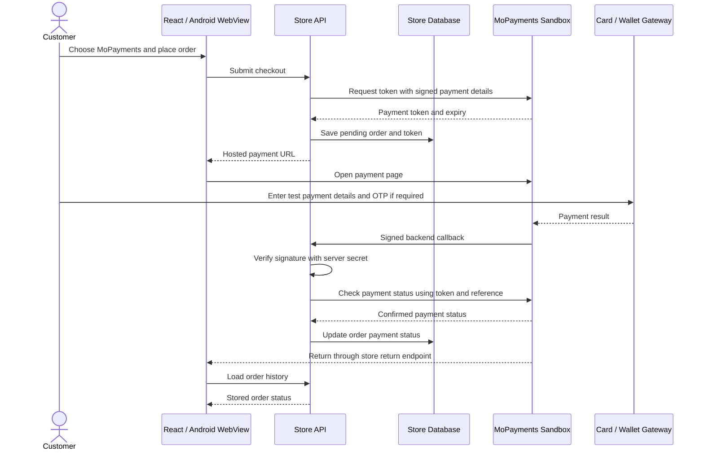

# MoPayments UAT - 7-8 September 2026

## Scope

Tests used the configured sandbox merchant and MoPayments-provided test card.
No live payment credentials were used. Test card details, OTPs, payment tokens,
and merchant secrets are deliberately excluded from this report.

Initial gateway payments were created directly through the server's
MoPaymentsService with isolated `AVS-UAT-*` references. On 8 September, a real
store order was also created through the hosted API using the authorized admin
account: `ORD-1788852241828` (7,800 MMK), labeled `UAT TEST - DO NOT DELIVER`.
These tests do not yet establish that checkout, order updates, or the Android
WebView work end to end.

## Results

| Check | Result |
| --- | --- |
| Hosted API health | Passed: `/api/v1/health` returned healthy. |
| Sandbox token creation | Passed with the configured UAT credentials. |
| Visa desktop payment | SUCCESS, 1,000 MMK, gateway MPGS, reference `AVS-UAT-CARD-1788765679324`. |
| Visa mobile browser payment | SUCCESS, 1,000 MMK, gateway MPGS, reference `AVS-UAT-MOBILE-1788766109597`. Tested at 390 x 844; bank checkout had no horizontal overflow. |
| Real return-payload signature | Passed using the configured UAT secret and the signed POST received during the mobile Visa return. |
| Status API | Initially failed parsing; corrected locally and verified against real PROCESSING and SUCCESS responses. |
| Hosted return endpoint | Returned HTTP 500 for the isolated payments. Cause is not established; no corresponding store orders existed. Hostinger logs and a real test order are needed. |
| MPU | Previous isolated attempts timed out. Actual store order `ORD-1788852241828`, payment ID `885161059181957120`, 7,800 MMK, reached OTP entry. OTP sent to registered mobile/email; gateway last reported PROCESSING. Completion awaits OTP. |
| WavePay | OTP submissions for references `885159284686725120` and `885160287679029248` were rejected with `OTP has expired.` The second rejection occurred while the MoPayments token was still valid and PROCESSING. Provider assistance is needed to verify OTP lifetime and matching reference. No successful payment yet. |
| Automated payment tests | Passed: 2 suites, 22 tests. |
| Frontend tests | Passed: 9 files, 26 tests, including admin payment details updating after a query refresh. |
| Server TypeScript build | Passed. |
| Admin authentication and order creation | Passed using the corrected admin credentials. Hosted API accepted the test order and issued a sandbox payment URL; payment was restricted to MPU. |
| Store order marked paid by backend callback | Not verified. Requires the test payment to complete and the updated server deployment. |
| Native Android app checkout | Not tested in this session. |

## Fix Made During Testing

The real status response contains `data.merchant_reference_id` and
`data.payment_status`, but does not echo `data.token`. The previous parser
rejected this response, preventing callback processing from completing.

The parser now retains the request token, accepts the observed response, and
rejects mismatched references, mismatched echoed tokens, and unknown statuses.
New tests cover these cases. Null pending-payment fields are normalized to
undefined.

Local `MOPAYMENTS_PREFERRED_GATEWAYS` is now empty so all enabled merchant
gateways can be displayed. The server `.env` is ignored by Git.

## Admin Order Changes

- Separate payment status column and filter: Paid, Pending, Failed, Expired,
  and Timed out. Legacy missing statuses display Unknown.
- Order details show provider, gateway status, payment ID, transaction amount,
  and settlement amount when available.
- Orders refresh every 15 seconds while the page is active, with a manual
  Refresh button. Open order details use the refreshed data too.
- A repeated successful callback preserves existing processing, shipped,
  delivered, fulfilled, or cancelled fulfillment status.

These are local code changes; they have not been deployed or pushed in this
testing session. Admin refresh reads the stored payment status; it does not
replace the backend callback or directly query the gateway.

## Remaining UAT Steps

1. Deploy the updated server parser to Hostinger.
2. Clear `MOPAYMENTS_PREFERRED_GATEWAYS` in Hostinger if all enabled gateways
   should be offered. Keep `MOPAYMENTS_ENVIRONMENT=sandbox` for UAT.
3. Use a dedicated store test customer to place a real store order through
   checkout, and inspect Hostinger logs for the callback and return requests.
4. Confirm the backend verifies the callback, checks gateway status, updates
   the correct order to paid, and returns the customer to order history.
5. Complete MPU and WavePay with OTPs supplied through MoPayments' Viber group.
   Start fresh sessions if the current token or OTP has expired.
6. Verify failed/cancelled payments and repeat the checkout in the Android app.

## Payment Flow

The merchant secret is used only on the server for request signing and callback
verification. A browser redirect alone is not proof that an order is paid.

## WavePay retest - 2026-09-09

- Merchant reference: `AVS-UAT-WAVE-1788940317724`.
- WavePay reference: `885530494197047296`.
- Amount: 1,000 MMK (sandbox).
- Fresh OTP was accepted; supplied test PIN completed confirmation.
- Hosted result displayed payment successful; independent MoPayments status lookup returned `SUCCESS`, gateway `WAVEPAY`, transaction amount `1000`.
- This was a standalone gateway test, without an associated store order. It does not verify the order database/admin paid-status update or the storefront return/retry flow.
